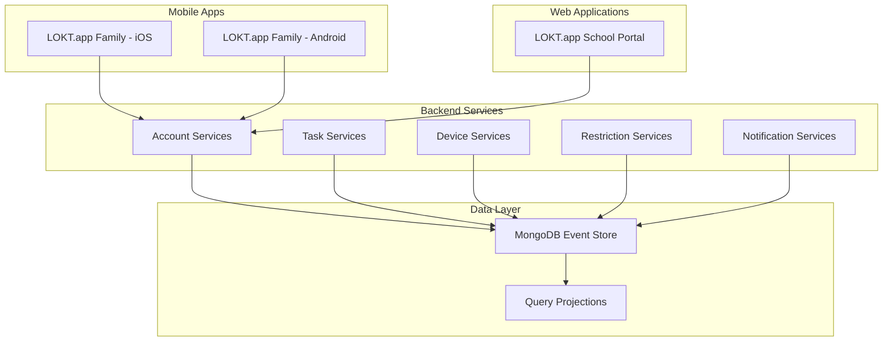

  
  
  # LOKT.app
  
  ### Less Screen. More Time.
  
  **Empowering families and schools with smart digital wellness solutions**
  
  
  
  
  
  

---

## 🌟 About LOKT.app

LOKT.app is a comprehensive digital wellness platform designed to help families and educational institutions create healthier relationships with technology. Our mission is to provide powerful, intuitive tools that promote balanced screen time and meaningful real-world connections.

### Our Vision

In an increasingly digital world, we believe technology should enhance—not replace—human connection. LOKT.app empowers parents, educators, and children to take control of their digital lives through smart parental controls, educational management systems, and family engagement tools.

---

## 🚀 Our Products

### 📱 LOKT.app Family

**The complete family digital wellness solution**

[Visit LOKT.app Family →](https://lokt.app/)

LOKT.app Family helps parents and children build healthy digital habits together. Our intuitive mobile app makes it easy to manage screen time, set age-appropriate boundaries, and foster positive relationships with technology—all while keeping families connected.

#### Key Features
- 👨‍👩‍👧‍👦 **Family-First Design** - Separate experiences for parents and kids that work together seamlessly
- 📊 **Smart Insights** - Understand your family's digital habits with clear, actionable reports
- ⏰ **Screen Time Management** - Set healthy limits that adapt to your family's needs
- 🎯 **Reward & Motivate** - Turn good habits into achievements with our engaging reward system
- 🔒 **Age-Appropriate Controls** - Keep kids safe with content filtering tailored to their age
- 💬 **Stay Connected** - Real-time communication keeps your family in sync

#### Technology Stack
- **Mobile Framework**: NativeScript 8.9 with Angular 18
- **Platform**: iOS & Android (cross-platform)
- **Backend Integration**: Real-time sync with microservices
- **Security**: Firebase authentication, encrypted data storage

---

### 🏫 LOKT.app School

**Digital wellness management for educational institutions**

[Visit LOKT.app School →](https://lokt.app/schools)

LOKT.app School empowers educators and administrators to create safe, focused digital learning environments. Our comprehensive platform helps schools manage devices, implement policies, and ensure students stay on task—whether in the classroom or learning remotely.

#### Key Features
- 🏢 **Enterprise-Grade Management** - Scalable from single classrooms to entire school districts
- 👥 **Centralized Control** - Manage students, teachers, and devices from one intuitive dashboard
- 🛡️ **Policy Enforcement** - Implement and monitor content restrictions across all school devices
- 📱 **Device Fleet Management** - Track, configure, and secure school-issued devices at scale
- 📊 **Usage Analytics** - Gain insights into digital learning patterns and compliance
- 🎓 **Flexible Organization** - Group by grade, class, department, or custom categories

#### Technology Stack
- **Frontend**: Angular 19 with Angular Material (Azure Blue theme)
- **State Management**: NgRx for scalable state architecture
- **Backend**: RESTful microservices integration
- **Deployment**: Docker containers with AWS ECR
- **Security**: JWT authentication, role-based access control

---

### ⚙️ LOKT.app Services

**Enterprise-grade microservices backbone**

LOKT.app Services is the robust backend platform powering all LOKT.app products. Built on modern microservices architecture with CQRS and Event Sourcing patterns, it ensures scalability, reliability, and real-time responsiveness.

#### Architecture Highlights
- 🏗️ **CQRS Pattern** - Separation of command and query responsibilities
- 📝 **Event Sourcing** - Complete audit trail with Axon Framework
- 🔄 **Microservices** - Domain-driven, independently deployable services
- 🗄️ **MongoDB** - Event store and query projections
- 🔐 **JWT Security** - Token-based authentication across services
- 📊 **Observability** - Spring Boot Admin, Prometheus metrics

#### Service Domains
- **Account Services** - User management, authentication, payments
- **Task Services** - Task creation, scheduling, and execution
- **Device Services** - Device registration and control
- **Restriction Services** - Content filtering and policy enforcement
- **Notification Services** - Real-time webhooks and push notifications

#### Technology Stack
- **Framework**: Spring Boot 3.2 with Java 17
- **Event Sourcing**: Axon Framework 4.9
- **Database**: MongoDB (event store + projections)
- **Deployment**: Docker with multi-stage builds
- **Monitoring**: Spring Boot Admin, Micrometer, Prometheus

[Learn more about LOKT.app Services →](https://github.com/lokt-app/digi-services)

---

## 🏗️ Platform Architecture

---

## 🎯 Why Choose LOKT.app?

### For Families
- ✅ **Simple & Intuitive** - Get started in minutes, no technical expertise needed
- ✅ **Privacy Protected** - Your family's data is encrypted and never sold
- ✅ **Positive Parenting** - Build healthy habits through encouragement, not just restriction
- ✅ **Works Everywhere** - Seamless experience across iOS and Android devices
- ✅ **Affordable** - Powerful features without breaking the family budget

### For Schools & Institutions
- ✅ **Enterprise Scale** - From small schools to large multi-campus districts
- ✅ **Customizable Policies** - Tailor digital rules for different grades and departments
- ✅ **Complete Visibility** - Monitor and manage all devices from a single platform
- ✅ **Professional Support** - Dedicated assistance for IT administrators and educators
- ✅ **Proven Technology** - Built on enterprise-grade infrastructure for reliability

### For Developers
- ✅ **Microservices** - Independent, scalable service architecture
- ✅ **Event-Driven** - CQRS and Event Sourcing for reliability
- ✅ **Well-Documented** - Comprehensive documentation for each component
- ✅ **Modern Tech** - Spring Boot, Angular, NativeScript, MongoDB

---

## 🛠️ Technology Ecosystem

### Frontend

### Backend

### DevOps

---

## 📞 Contact & Support

### Get in Touch
- 📧 **Email**: it@digitheapp.com
- 🌐 **Website**: [https://lokt.app](https://lokt.app)
- 💼 **Business Inquiries**: [Contact Us]

### Stay Connected
Follow us for updates, tips, and announcements about digital wellness and LOKT.app platform updates.

---

## 📄 License

LOKT.app is proprietary software. All rights reserved.

For licensing inquiries, please contact: it@digitheapp.com

---

  
### Built with ❤️ by the LOKT.app Team

**Empowering families and schools to thrive in the digital age**

[Website](https://lokt.app) • [Documentation] • [Support]

